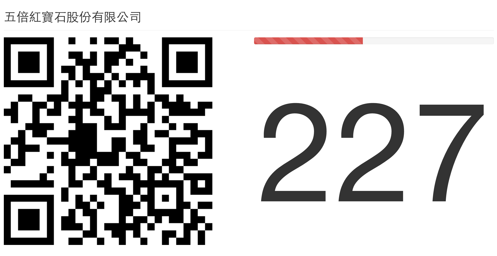

# 打卡集氣棒

本棒會在指定 FB 粉絲頁或打卡點，其按讚數量與打卡數總和超過指定數量時，放出慶祝特效。

## 使用範例

- 打卡最大值為 1000：http://5xruby.github.io/FB-checkin?max_count=1000
- 指定粉絲團與最大值：http://5xruby.github.io/FB-checkin?max_count=500&obj_id=IMWaffle

## 變數說明

變數           | 預設值  | 說明
-------------- | ------- | ----
`obj_id`       | 5xruby  | 粉絲頁 ID
`font_size`    | 0.5     | 倒數數字大小
`auto_fire`    | false   | 自動放煙火
`btn_size`     | 100     | 啟動煙火按大小
`qr_code_size` | 600     | QRCode 圖片大小
`max_count`    | 500     | 讚、打卡最大值
`cycle`        | 1000    | 更新頻率